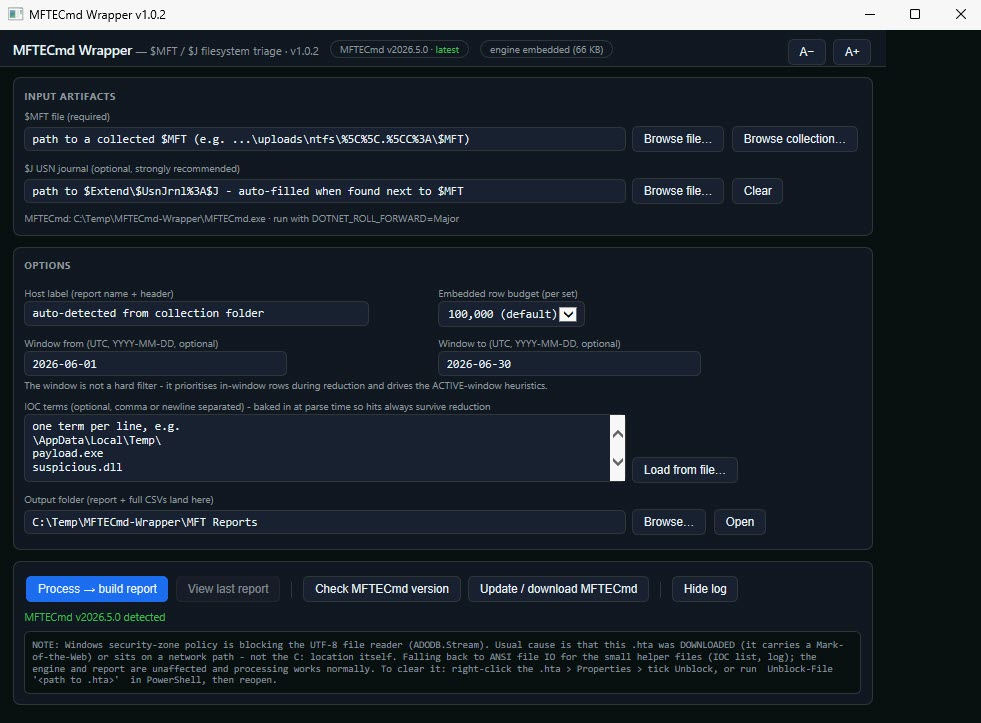
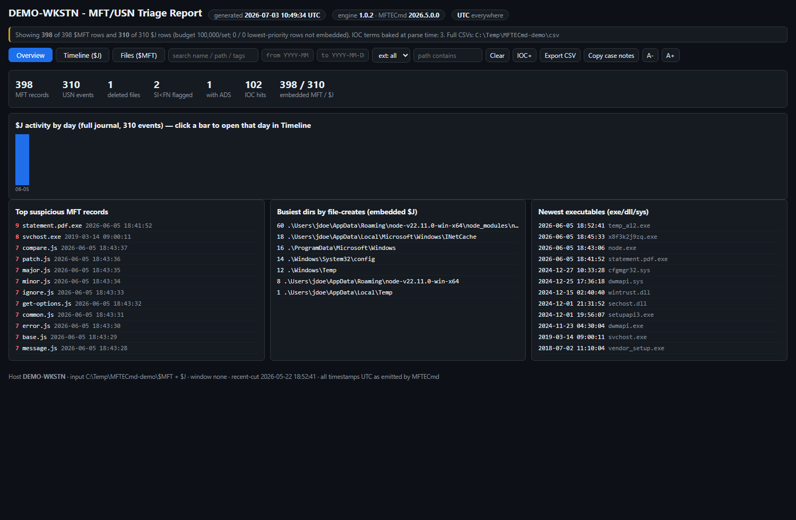
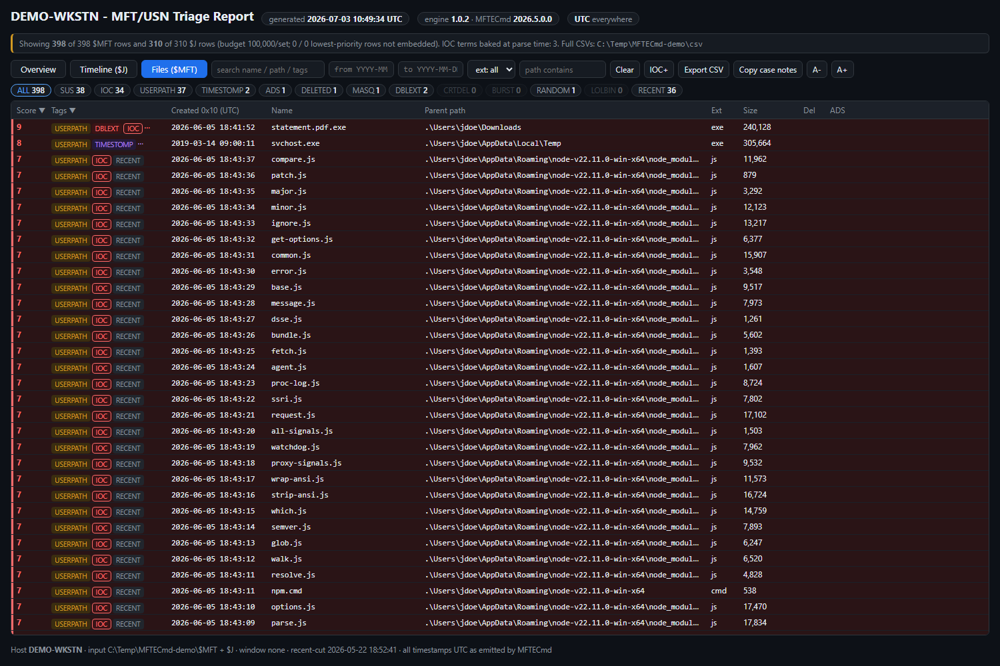
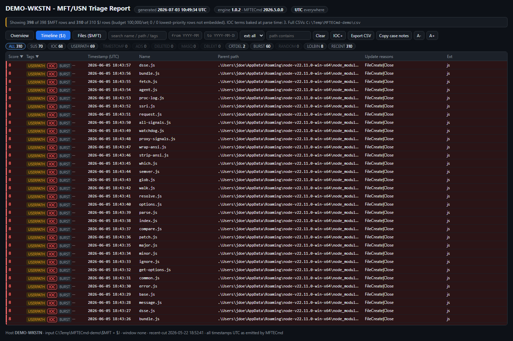

# MFTECmd Wrapper

A single-file, double-clickable GUI for triaging the **NTFS `$MFT` and `$J` (USN journal)** with [Eric Zimmerman's MFTECmd](https://ericzimmerman.github.io/) — built for DFIR casework.

One `.hta` file, no install and no dependencies: it runs MFTECmd for you, scores the millions of resulting rows against filesystem-focused heuristics, and produces a **self-contained, interactive HTML report** — one file per host — that you open in Edge.

Sibling of [PECmd-Wrapper](https://github.com/bpmorris22/PECmd-Wrapper), [SrumECmd-Wrapper](https://github.com/bpmorris22/SrumECmd-Wrapper), [AmcacheParser-Wrapper](https://github.com/bpmorris22/AmcacheParser-Wrapper) and [SQLECmd-Wrapper](https://github.com/bpmorris22/SQLECmd-Wrapper) — same look, deliberately complementary artifact. Prefetch/Amcache tell you *what ran*; SRUM tells you *what talked*; the `$MFT`/`$J` tell you **what appeared, changed, and was deleted, and exactly when** — the staging, timestomping, and create-then-delete story the execution artifacts can't show. It is also the one artifact that still has evidence when a SYSTEM boot-service RAT leaves no per-executable prefetch.

The single-file launcher:



## Why this one is a hybrid (and not pure-HTA like its siblings)

The other wrappers hold their whole dataset inside the `.hta` and render it in `mshta.exe`. That works for hundreds or thousands of rows. An `$MFT` is routinely **0.5–3 million rows** and a `$J` similar — far past what mshta's ES5 engine can load or render. So this tool splits the work:

```
MFTECmd-Wrapper.hta   (the only file you keep; a thin launcher/form)
  |-- extracts -->  MFTECmd-Engine.ps1     (embedded inside the .hta; dropped next to it at run time)
  |                    |-- runs -->  MFTECmd.exe  ($MFT, then $J with -m)
  |                    |-- writes -> <HOST>-MFT-Report.html   (self-contained; embeds a reduced, scored dataset)
  |                    \-- keeps  -> .\csv\*.csv               (the FULL CSVs, for Timeline Explorer)
  \-- opens  -->  the report in Edge (V8 handles a few hundred thousand rows easily)
```

The launcher is a form only — it never loads row data, so mshta stays fast. The heavy parse/score/reduce runs in PowerShell. The report renders in Chromium with a virtualized grid. You still keep and distribute **one file**: the `.hta` carries the engine inside itself.

## The reduction banner (read this)

A report embeds a **budget** of the highest-priority rows per artifact (default 100,000 each), not all of them. The banner at the top of every report states exactly what was kept vs. parsed, e.g. *"Showing 100,000 of 1,490,697 $MFT rows…"*. Rows are kept in priority order — **IOC hits are never dropped**, then by score, then in-window rows, then newest-first — and the full CSVs always remain on disk in `.\csv\` for Timeline Explorer. Nothing is silently truncated; the counts are always on screen.

## The report

The report opens in Edge with an **Overview** (headline stats, a clickable per-day `$J` histogram, and a top-suspicious / busiest-dirs / newest-executables dashboard):



A virtualized, scored **Files ($MFT)** grid — filter and sort a hundred thousand rows with no lag; suspicious rows shade red, every tag carries its reasoning, and clicking a row opens a detail pane with both `0x10`/`0x30` timestamps and the cross-linked `$J` events:



And a **Timeline ($J)** view of USN events — file-creation bursts, create-then-delete staging, and IOC hits surfaced first:



*(Screenshots are from a synthetic demo dataset — a fake `DEMO-WKSTN` host with a made-up node-based staging scenario — not real case data.)*

## Features

- **Runs MFTECmd for you** — parses `$MFT`, then `$J` with `-m` (so USN events resolve their parent paths), to timestamped CSVs, in a visible console so the UI never freezes. Re-runs reuse existing CSVs.
- **Finds the artifacts for you** — point the input at a collection folder and it recursively locates `$MFT`; the sibling `$Extend\$UsnJrnl%3A$J` is auto-filled, and a hostname is guessed from the `Collection-<host>-<date>` folder name. URL-encoded Velociraptor paths (`C%3A`) work as-is.
- **Self-managing tooling** — finds `MFTECmd.exe` next to the `.hta` (or in a KAPE `Modules\bin`, or `C:\ZimmermanTools`), checks the latest version, and can download a self-contained copy with one click. Sets `DOTNET_ROLL_FORWARD=Major` automatically.
- **IOCs baked in at parse time** — paste or load terms; they are matched (case-insensitive substring, across full path + name + Zone.Identifier) during parsing, so **hits are guaranteed to survive reduction** and always sort to the top. Add more terms in the report afterwards for an ad-hoc scan of the embedded subset.
- **Three views of one run**:
  - **Overview** — headline stats, a clickable per-day `$J` activity histogram (over the *full* journal, before reduction), and a dashboard: top suspicious records / busiest create-directories / newest executables.
  - **Timeline ($J)** — one row per USN event: timestamp, tags, name, path, update reasons. The recent-activity view.
  - **Files ($MFT)** — one row per record: tags, both `0x10`/`0x30` create times, name, path, size, deleted, ADS.
- **Virtualized grid** — filter and sort a hundred thousand rows with no pagination and no lag (only the visible rows are in the DOM).
- **"Story of an entry" detail pane** — click any row: all timestamps with the SI/FN timestomp delta highlighted, the Zone.Identifier download source, the score breakdown, and cross-links between an `$MFT` record and every `$J` event for the same entry — creation, writes, renames, deletion, in one place.
- **Suspicion scoring** tuned on real incident data (table below). Suspicious rows are shaded; every tag carries its reasoning.
- **Filters & reporting** — free-text search, tag chips with live counts, UTC date range, extension and path-scope filters (all persist across views); export the filtered view to CSV, or copy formatted lines into case notes.

## Quick start

1. Download `MFTECmd-Wrapper.hta` into an empty folder.
2. Double-click it. If `MFTECmd.exe` isn't found, the app offers to download the latest official build from `download.ericzimmermanstools.com` into the same folder.
3. Browse to a collected `$MFT` (or **Browse collection** and let it find one). The sibling `$J` and a host label fill in automatically.
4. Optionally paste IOC terms and set a UTC time window, then click **Process → build report**. A console shows live progress; when it finishes, the report opens in Edge and lands in your output folder alongside a `csv\` folder of the full parsed CSVs.

The live `$MFT`/`$J` on a running machine are locked — parse a collected copy (Velociraptor, KAPE, or a mounted image), not `C:\$MFT` directly.

## Suspicion heuristics

Computed in the engine, per row, with a reason string behind every tag. `$J` timeline rows shade at score ≥ 2; `$MFT` file rows shade at ≥ 3 (the MFT catalogs *everything*, so its noise floor is higher). "Recent" is anchored to the newest timestamp **in the dataset**, not the clock, so collections analyzed weeks later still work.

| Tag | Trigger | Score |
|---|---|---|
| `IOC` | Analyst-supplied indicator hit (substring in path / name / Zone.Identifier). Weighted to outrank any stack of generic tags. | +5 |
| `USERPATH` | Risky-extension file created/written in a user-writable path (`\Users\`, `\AppData\`, `\Temp\`, `\Downloads\`, `\ProgramData\`, `\PerfLogs\`, `\Windows\Temp\`, `$Recycle.Bin`, `\Public\`, **`\config\systemprofile\`** — the SYSTEM-service staging path). `\WinSxS\` and servicing paths excluded. | +2 |
| `TIMESTOMP` | MFTECmd `SI<FN` flag set and the second-level `$STANDARD_INFO` vs `$FILE_NAME` create times differ. +3 only for a risky-ext file in a user path with **no** Zone.Identifier; +1 otherwise (downloaded/installer/cloud-sync files legitimately mismatch). | +1 / +3 |
| `MASQ` | OS-binary name (svchost, lsass, explorer, …) living **outside** `\Windows\`. | +3 |
| `DBLEXT` | Deceptive naming: `invoice.pdf.exe`-style double extension, or a **directory** named like a document (the `document.docx`-as-a-folder loader pattern). | +2 |
| `CRTDEL` | *($J)* Same entry created **and** deleted within 48 h — staged then cleaned. | +2 |
| `BURST` | *($J)* ≥ 50 file-creates in one directory within 10 min — a staging burst. | +1 |
| `ADS` | Has an alternate data stream; +1 more if a Zone.Identifier (downloaded) is present. | +1 (+1) |
| `RANDOM` | Hex/entropy-smelling risky-ext file name (deliberately conservative — system names like `comctl32` do not fire). | +1 |
| `LOLBIN` | *($J)* Dual-use binary (powershell, cmd, rundll32, certutil, node, python, …) written to a user-writable path. | +1 |
| `DELETED` | *($MFT)* A deleted risky-extension file (recoverable from the record). | +1 |
| `RECENT` | Timestamp within 14 days of the dataset's newest — context only, scores nothing. | +0 |

## Notes & limitations

- **Parse a collected copy, not the live volume.** `C:\$MFT` and `$J` are locked while Windows runs. Collect with Velociraptor / KAPE / RawCopy or use a mounted image.
- All timestamps are shown **UTC, as MFTECmd emits them.** No local-time conversion, on purpose — it is the single biggest source of DFIR timeline errors.
- **`SI<FN` timestomp is noisy.** Tens to hundreds of thousands of rows on a normal disk carry a benign `$SI`/`$FN` mismatch (installers, archive extraction, file copies). The tag is corroborating, not primary — the high-signal tags are `IOC`, `DBLEXT`, `MASQ`, and `CRTDEL`+`BURST`. On a *clean* host the top of the list is expected to be recognizable OS artifacts; a report with **0 IOC hits** and only benign OS noise at the top is a meaningful all-clear.
- **The report is a reduced view; the CSVs are complete.** If you need a row outside the embedded budget, it is in `.\csv\` — open it in Timeline Explorer, or re-run with a larger budget or a tighter time window.
- **`$J` only goes back as far as the journal.** The USN journal rolls over; on a busy disk it may only reach back a week or two, so older staging shows only in the `$MFT`. (The engine handles an `$MFT`-only run when no `$J` is available.)
- A default-budget report is ~30–50 MB and opens in a second or two in Edge. Very large embedded budgets (200k+) produce larger files.
- The `.hta` **launcher** requires Windows `mshta.exe` (present on every Windows box). The **report** requires only a modern browser (Edge/Chrome) and is fully offline/self-contained — safe to archive in a case folder and reopen years later.
- **Running from a network location** (mapped drive / UNC): the engine extracts locally first and falls back to `%TEMP%`; the small helper-file IO falls back to ANSI automatically. For full fidelity run from a local path.

## Command line

The launcher can be started with arguments so an artifact-finder (or a shortcut) opens it already pointed at an artifact:

```
mshta.exe "MFTECmd-Wrapper.hta" "<inputOrReport>" ["<outDir>"] [/auto]
```
- `<input>` — a `$MFT` file / collection directory (prefilled; the report is built if `/auto`), or an existing `.html` report to re-open.
- `<outDir>` — output directory for the report and CSVs (optional).
- `/auto` — build the report immediately.

## Credits

- [Eric Zimmerman](https://ericzimmerman.github.io/) for MFTECmd and the EZ Tools suite — this is an unaffiliated wrapper around his parser; all parsing credit is his.

## License

MIT — see [LICENSE](LICENSE). Copyright (c) 2026 Ben Morris.
